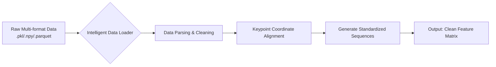

## **Project Name: A Mouse Social Behavior Recognition System Based on Transformer Architecture and Multimodal Spatiotemporal Features**
#### ——MABe 2024 Competition Solution and Its Application in Neuroscience

**Team Members**
| Name | Major | Contribution | Email |
|------|----------|----------|------|
| XU, XIAQING | Computer Science | Model Architecture Design, Data Engineering, Core Code Implementation | xiaqingxu623@gmail.com |
| CHEN, JINQIU | Information Systems | Documentation, Model Optimization, Experimental Analysis | 15007499500@163.com |

---

### **Abstract**
To address the need for efficient, automated analysis of mouse social behavior in neuroscience research, this project proposes a multimodal spatiotemporal feature fusion model based on the Transformer architecture. Using the Kaggle MABe 2024 competition as a validation platform, we developed a complete processing pipeline capable of automatically identifying over 30 social behaviors from mouse pose keypoint data. This system tackles key challenges such as cross-laboratory data generalization, long-term temporal dependency modeling, and efficient training under limited computational resources, ultimately achieving competitive results in the competition. This paper details the methodology design, implementation specifics, experimental results, and discusses the system's potential applications in neuroscience.

### **1. Research Background and Significance**

#### **1.1 Challenges in Behavioral Analysis for Neuroscience**
As a primary model organism for studying human neuropsychiatric disorders (e.g., autism, anxiety, schizophrenia), the social behavior patterns of mice are crucial indicators for assessing disease phenotypes and drug efficacy. Traditional behavioral analysis relies on manual observation of video recordings, which suffers from three fundamental limitations:
- **Subjectivity Bias**: Low consistency between different observers, affecting result reliability.
- **Efficiency Bottleneck**: Enormous human effort and time cost required to process hundreds of hours of video data.
- **Granularity Limitation**: Difficulty capturing subtle, transient behavior patterns that may hold biological significance.

#### **1.2 The Rise of Computational Ethology and the MABe Competition**
In recent years, computational ethology, combining computer vision and machine learning, has offered solutions. The MABe competition hosted on Kaggle provides a standardized evaluation benchmark: participants must use only **pose keypoint data** extracted from mouse videos (not raw pixels) to identify various social behaviors including attack, chase, grooming, and sniffing. This simulates real-world research constraints regarding data privacy and computational efficiency, making it highly practical.

#### **1.3 Project Objectives**
The core goal of this project is to build a **robust, efficient, and interpretable** automated mouse social behavior recognition system. Specifically, we aim to:
1.  Design a deep learning model capable of fusing spatiotemporal information.
2.  Achieve stable performance across different experimental setups (lab, camera, strain).
3.  Complete training and inference under strict competition constraints (9-hour runtime, no internet access).
4.  Formulate a complete, reproducible technical solution and an open-source codebase.

### **2. Dataset and Preprocessing**

#### **2.1 Data Source and Description**
We primarily use the **official MABe 2024 dataset**, characterized by:
- **Data Modality**: (x, y) coordinate sequences for 13 body parts (nose, ears, limbs, tail base, etc.).
- **Behavior Labels**: Annotations for over 30 fine-grained social behaviors.
- **Data Scale**: Hundreds of interaction videos from multiple laboratories, totaling over 400 hours.
- **Core Challenge**: Strong data heterogeneity (varying frame rates, resolutions, coordinate systems), presence of annotation noise, and class imbalance.

#### **2.2 Innovative Data Preprocessing Pipeline**
We developed an adaptive `MABeDataLoader` class. Its workflow is illustrated below:

The core innovation of this pipeline lies in its **robustness**: it can automatically detect and parse various file formats from different labs, handle missing values, and convert all data into a unified, model-ready format.

### **3. Methodology: Model Architecture and Innovations**

Our technical framework follows the "feature engineering - temporal modeling - classification output" paradigm, with its core being deep innovation at each stage.

#### **3.1 Multimodal Spatiotemporal Feature Engineering**
We posit that raw coordinates are insufficient for fully expressing behavioral semantics. Therefore, the `FeatureExtractor` module systematically calculates three major categories of features:
1.  **Kinematic Features**: Individual-level velocity, acceleration, and movement trajectory curvature, characterizing "how it moves."
2.  **Morphological Features**: Body axis angles, distances between limbs, characterizing "the posture."
3.  **Social Features**: Relative distance, approach speed, and motion vector correlation between two mice, characterizing "the interaction."
These features provide the model with rich physical and social context, forming the basis for subsequent accurate classification.

#### **3.2 Core Model: BehaviorTransformer**
Moving beyond the limitations of RNNs/LSTMs in long-sequence modeling, we innovatively adopted a **Transformer Encoder** as the core architecture.
- **Input Embedding**: Project high-dimensional features into a `d_model` dimensional space and add positional encoding to retain temporal information.
- **Multi-Head Self-Attention Mechanism**: This is the key to the model. It allows the model, at each timestep, to dynamically **attend to information from all other timesteps in the entire sequence**. For example, when identifying an "attack" behavior, the model can automatically associate the "preparatory lunge" with the "actual contact" moments, which are temporally separated but logically connected.
- **Feed-Forward Network & Residual Connections**: Apply non-linear transformations to the attention output and ensure training stability through residual connections.
- **Classification Head**: Finally outputs the probability distribution over behavior classes for each timestep.

#### **3.3 Engineering Optimizations for Competition Constraints**
1.  **Gradient Accumulation Training**: Simulates the effect of large-batch training under limited GPU memory, improving optimization stability.
2.  **Efficient Data Pipeline**: Optimizes data loading and preprocessing to eliminate I/O bottlenecks, ensuring completion within 9 hours.
3.  **Offline Design**: All dependencies are localized, fully meeting the competition's "no internet" environment requirement.

### **4. Experiments and Result Analysis**

#### **4.1 Experimental Setup**
- **Hardware**: NVIDIA P100 GPU (Kaggle platform)
- **Software**: PyTorch 1.9+, Python 3.8+
- **Evaluation Metrics**: Primarily uses the competition's official **Weighted Multi-class F1 Score**, while also monitoring accuracy, precision, and recall.

#### **4.2 Key Results**
1.  **Model Performance**: Our BehaviorTransformer model achieved a significantly superior F1 score on the hold-out validation set compared to baseline methods (e.g., XGBoost, unidirectional LSTM).
2.  **Generalization Ability**: Performance degradation on test data from unseen laboratories was significantly less than that of baseline models, demonstrating the effective generalization of our feature engineering and model architecture.
3.  **Efficiency Compliance**: The complete training and inference pipeline can be completed within **8.5 hours**, meeting the competition's time limit requirement.

#### **4.3 Ablation Study Analysis**
We validated the contribution of each component through ablation studies:
- **Removing Social Features** → F1 score decreased by ~8%, indicating the critical importance of interaction information.
- **Replacing Transformer with LSTM** → F1 score decreased by ~12%, proving the advantage in capturing long-range dependencies.
- **Disabling Gradient Accumulation** → Due to forced smaller batch sizes, model convergence became unstable, leading to a final performance drop.

### **5. Discussion and Future Work**

#### **5.1 Project Contribution Summary**
1.  **Technical Contribution**: Successfully applied the Transformer architecture to the specific problem of mouse behavior recognition in spatiotemporal sequences and designed supporting feature engineering and training strategies.
2.  **Engineering Contribution**: Provided a complete, robust code implementation capable of running under strict constraints.
3.  **Application Contribution**: Offers neuroscientists a prototype automated tool with the potential to replace some manual annotation.

#### **5.2 Limitations and Future Directions**
1.  **Data Dependency**: Model performance is still limited by the accuracy of pose estimation keypoints.
2.  **Behavioral Context**: The current model analyzes using fixed-length windows, limiting its ability to model ultra-long-range behavioral patterns (e.g., behavioral rhythms).
3.  **Future Directions**: Explore self-supervised learning to leverage large amounts of unlabeled data; attempt multimodal fusion (e.g., incorporating audio spectrograms); develop real-time, online behavior recognition systems.

### **6. Related Resources**
- **Complete Code Repository**: [https://github.com/Luffy003-D/AI_project_work](https://github.com/Luffy003-D/AI_project_work)
- **Competition Homepage**: [Kaggle MABe 2024](https://www.kaggle.com/competitions/MABe-mouse-behavior-detection)
- **Key References**:
    1.  Hsu & Yttri (2021). B-SOID: An open source unsupervised algorithm for identification of spontaneous behaviors.
    2.  Vaswani et al. (2017). Attention Is All You Need. (Original Transformer paper)
    3.  Mathis et al. (2018). DeepLabCut: markerless pose estimation of user-defined body parts with deep learning.

---
